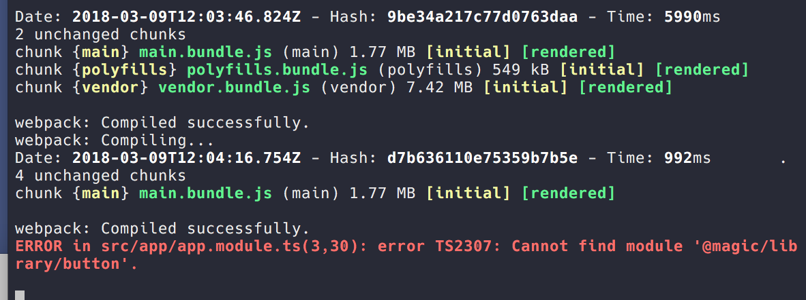

# ng-packagr entry points problems

## Run
1. npm install ( *Skip if you want, build checked in*)
2. build the lib (`npm run lib`) ( *Skip if you want, build checked in*)
3. cd lib-dist and run `npm link`
4. cd ../consumer and run `npm install` and `npm link @magic/library`
5. run the consumer with `npm run start` if you run into compiler errors, touch the application module and save. It will work then plus an error despite a successful build.

## Problem
I want to remove a module from the main entry
so that peer dependencies required only for this module
are not requested and included by the main entry.

But it seems that this is not working.
You have to always include a module in the main entry
otherwise you run into a "cannot find module" situation.

Sometimes the app still works then but you see an error together with a success message. The app worls but where is the error coming from

## Library Building
Additional entry points are supported by ng-packagr.
This library contain two entry points `button` and `foo`.

1. Button is only available through the sub entry points
Only this will work:
+ `import { ButtonModule } from '@magic/library/button';`

2. Foo is made available through the sub entry and the main entry.
those two will work:
+ `import { FooModule } from '@magic/library/fpp';`
+ `import { FooModule } from '@magic/library';`


The build looks promising:

`npm run lib`
```
> ng-packagr -p lib/package.json

Building Angular Package
...
Built @magic/library
Building entry point '@magic/library/button'
...
Writing package metadata
Built @magic/library/button
Building entry point '@magic/library/foo'
...
Built @magic/library/foo
Built Angular Package!
- from:foo-packagr-sub-entry/lib
- to:  foo-packagr-sub-entry/lib-dist

```


## System
Angular CLI: 1.7.3
Node: 8.9.4
OS: darwin x64
Angular: 5.2.8
... animations, common, compiler, compiler-cli, core, forms
... http, language-service, platform-browser
... platform-browser-dynamic, router

@angular/cli: 1.7.3
@angular-devkit/build-optimizer: 0.3.2
@angular-devkit/core: 0.3.2
@angular-devkit/schematics: 0.3.2
@ngtools/json-schema: 1.2.0
@ngtools/webpack: 1.10.2
@schematics/angular: 0.3.2
@schematics/package-update: 0.3.2
typescript: 2.5.3
webpack: 3.11.0